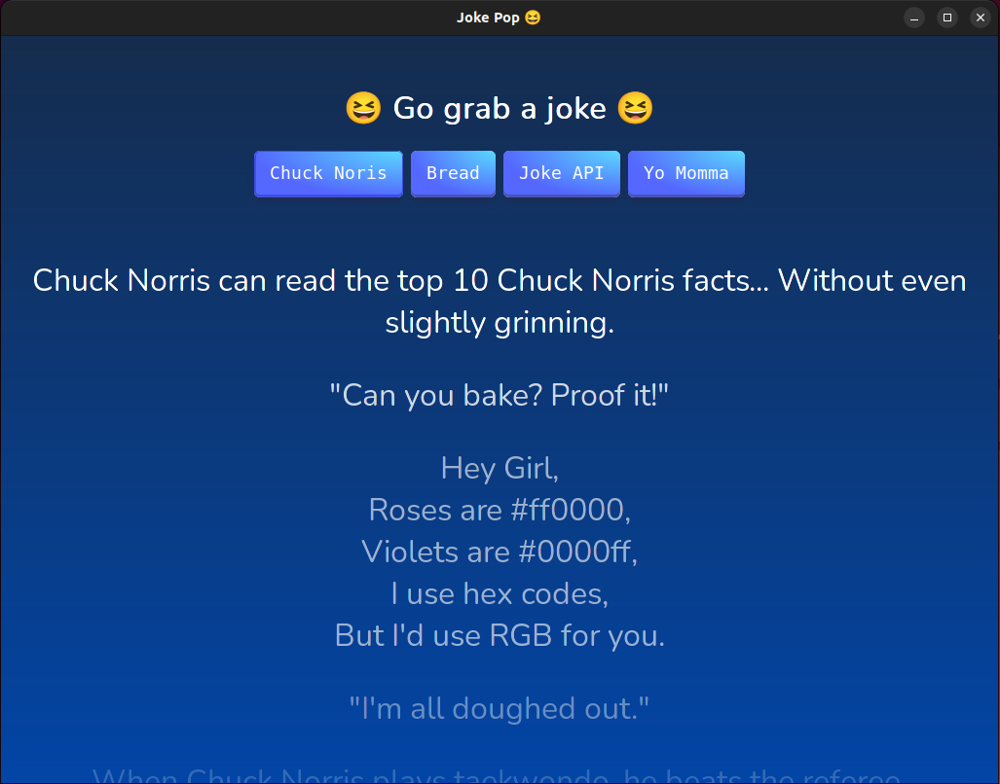

# Joke Pop

Display some jokes fetched from different APIs



## Install latest version

```shell
curl https://raw.githubusercontent.com/dennisdebest/joke-pop/master/install.sh | sudo bash 
```

## Start the app

```shell
joke-pop
```

## About

This was created to test the [Wails](https://github.com/wailsapp/wails) desktop app generation.